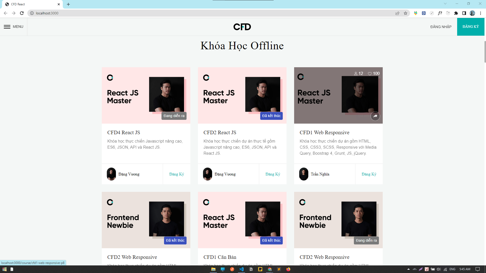

# CFD COURSE WEBSITE
CFD COURSE là 1 website khóa học được xây dựng bằng Framwork React. Bao gồm các tính năng giới thiệu khóa học, và xem nội dung chi tiết các khóa học. 

## Preview

**[Visit My Website](https://cfd-course-website.vercel.app/)**

## Features
- contact page: sử dụng để làm chức năng validate form
- sử dụng react-router-dom để làm SPA
- sử dụng thư viện axios để lấy danh sách các khóa học từ api
- thực hiện chức năng authorization bằng JWT
- sử dụng Context và Redux để quản lý state user Login
- build dự án và deploy lên Vercel

## Hooks
- useContext : quản lý state pop-up isLogin ( nếu user chưa login -> thì bật popup lên)
- Redux : quản lý store user info (khi user đăng nhập thành công)

## More Detail
### Login/Register Account
- Thực hiện chức năng authen client bằng JWT
- Sử dụng useContext để quản lý thông tin user sau khi login thành công.
- Sử dụng localStorage để lưu accessToken để authorize yêu cầu của client 

### Folder
chia folder theo chức năng.
##### hooks
1. useAuth : Context(bắt đầu bằng use) bọc toàn bộ ứng dụng, quản lý state User data Login

2. viết lại useAuth: hàm tạo (action contructor), mục đích dùng để đefine Action -> reducer